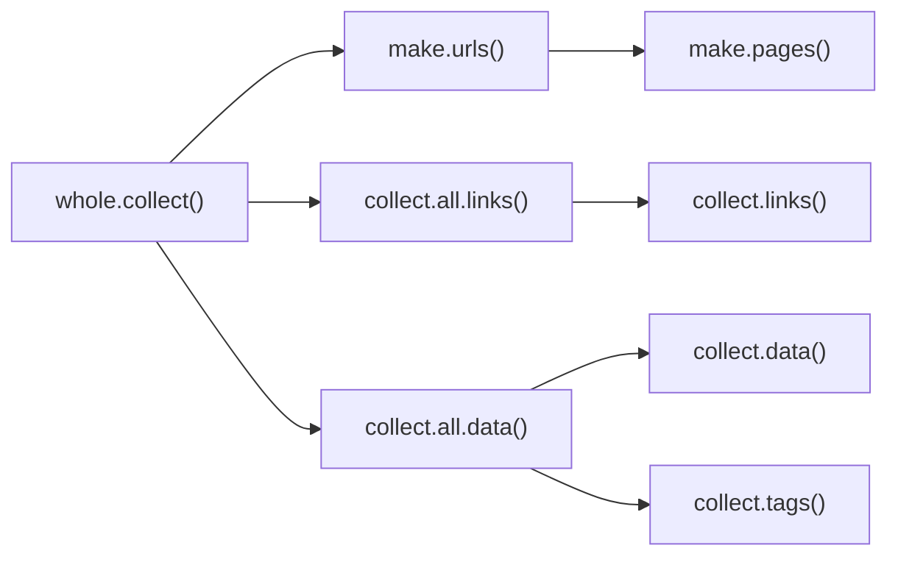

# anime_genre
> Analyse de l'évolution des genres des animes. Nous sommes particulièrement intéressé par les questions suivantes:
>
> - Comment a évolué le marché de l'anime en nombre et en platforme?
> - Comment les genres ont évolué avec le temps et quel en serait l'explication?
> - Est-ce que la classification classique des publiques "shounen, shoujo, seinen, josei" fait toujours sens? À quoi sont-il lié et quelle est leur distribution et évolution dans le marché?
> - Comment se partage le marché des production? Qui sont les principaux studio de production et quel type de formats produise-t-il? Y-a-t-il une complémentarité de l'offre ou une convergence?
> - Y a-t-il une diversité dans l'offre des animes et si oui est-elle liée au temps et comment se manifeste-t-elle?

*Note: lorsqu'un nom de fichier est inscrit sous la forme `Dossier/fichier.extension`, ça veut dire que le fichier `fichier.extension` se trouve dans le dossier `Dossier`. Donc le fichier `Dossier_b/Ici/exemple.txt` veut dire: "`exemple.txt` se trouve dans le dossier `Ici` qui se trouve dans le dossier `Dossier_b`".*

# Plan

anime_genre:

- Dossier
- Scripts
  - Partie 1: Collecte et Nettoyage
  - Partie 2: Analyse préliminaire
  - Partie 3: Rapport
- Tâches

## Dossiers

Les dossier du Repository sont organisés de cette manière

- `Data`: Le dossier des données brutes
- `MyData`: Le dossier des données "propre" ou de travail
- `Note`: Le dossier des notes de travail
- `Results`: Le dossier avec les graphiques et les tableaux
  - `Figures`: Dossier des graphiques
  - `Tables`: Dossiers des tableaux
- `Scripts`: Le dossier avec tous les codes exceptés les rapports (.Rmd, .Qmd)
  - `Functions`: Le dossier contenant tous les scripts créant des fonctions d'usages

## Scripts

Dans ce projet, nous avons pour l'instant 4 scripts principaux que nous pouvons diviser en 3 étapes:

1. Collecte et Nettoyage (`Scripts/0_scraper.R` + `Scripts/functions/f_scraper.R`)
2. Analyse préliminaire (`Scripts/1_analyse.R`)
3. Rapport (`raport_mangas_genre.Rmd`)

### Partie 1: Collecte et Nettoyage

**Collecte et Nettoyage**: Dans cette partie nous collectons les données du site web `anime-planet.com` qui réuni des informations très intéressantes sur les animes depuis 1907. Nous collectons donc les information pour les mangas sorties entre 1907 et 2023. Toutefois, les données pour 2022 et 2023 sont incomplètes puisque ce sont principalement des prévisions (la collecte a été effectué en 2021). Toutes les fonctions nécessaire à la collecte ont été créées dans le fichier `Scripts/functions/f_scraper.R`. Elles peuvent être encore optimisées. Voici la carte d'appel des fonctions:

Le code peu être optimisé (surtout la fonction `collect.data()`). Le temps de collecte est approximativement de ==42 heures==. 

Ensuite le script `Scripts/functions/f_scraper.R` import les fonctions et utilise la fonction `whole.collect()` pour lancer tout le processus de collecte. Lorsque cette fonction est lancée, elle crée deux tableaux de données `Data/liste_anime_planet.Rda` et `Data/manga_genre.Rda`. Ce sont les données à leur état brute et il ne faut pas les modifier. Le script réalise ensuite un nettoyage de ces données et créer trois tableaux de données "propres pour une analyse": `MyData/manga_clean.Rda`, `MyData/manga_tags.Rda` et `MyData/mangas.csv`. Le fichier csv est un moyen de pouvoir partager les données facilement vers d'autres langages/logiciel statistiques.

### Partie 2: Analyse préliminaire

**Analyse préliminaire**: Le but est de réalisé une analyse descriptive aussi précis que possible à l'aide du fichier `1_analyse.R` (on peut créer d'autres scripts si nécessaire. Dans ce script nous testons une large variété de méthodes pour obtenir des graphiques. ==Mais il manque encore des tableaux de données==.

Voici les éléments qui ont pu être exploré jusqu'à maintenant:

*Note: par genres on entend les tags et par genres classiques/principaux on entend shounen, shoujo, seinen et josei.*

- Animes:
  - Évolution du nombre d'anime
- Genre:
  - Top 10 des genres les plus courants
    - Top 10 des genres les plus courants par période
  - Évolution des 4 genres classiques
    - Évolution des 4 genres classiques par base 100
    - Évolution de la part des 4 genres classiques
    - Évolution du genre shoujo
  - Corrélation des tags selon leur évolution pour les 4 genres classiques
    - Même chose avec les co-occurrences
    - Corrélation des genre "border-line"
    - Corrélation des genre à caractère sexuel
- Studio:
  - Évolution du nombre de studio d'animation
- ...

Une partie de ces graphiques ont été transférés dans le rapport (voir le fichier `rapport_mangas_genre.Rmd`)

### Partie 3: Rapport

Pour l'instant, il y a un seul rapport et il reprend qu'une partie des graphiques. 

## Tâches

À faire prochainement:

- [ ] Formuler une question de recherche adéquate
  - [ ] Transformer les question actuelle en hypothèse
  - [ ] Générer une question de recherche englobante
  - [ ] Décider d'autres analyses descriptives à poursuivre
    - [ ] Faire une liste de ces analyses
  - [ ] Décider des analyse inférentielles à réaliser
    - [ ] Faire une liste
  - [ ] Décider des modèles de régressions à employer
    - [ ] En faire la description
- [ ] Triller les graphiques du fichier `Scripts/1_analys.R`
  - [ ] Lesquels garde-t-on?
  - [ ] Dans quel ordre les générer/présenter
  - [ ] Dans quels scripts les distribuer
  - [ ] Réaliser les fonctions d'export
- [ ] Optimiser le code de collecte de données
  - [ ] Contrôler que le site web est toujours accessible
  - [ ] Contrôler que le code marche avec de plus petites listes
  - [ ] Refactoriser l'ensemble du code
    - [ ] Mettre à jour la carte des fonctions
  - [ ] Créer une version pour les requêtes
- [ ] Avancer le rapport `rapport_mangas_genre.Rmd`
  - [ ] Segmenter le rapport de manière appropriée
  - [ ] Régler les paramêtres
  - [ ] Créer une version quarto
- [ ] Contrôler les données de 2022
  - [ ] Contrôler avec les nouvelles données du site web si la liste de 2022 est cohérente.
    - [ ] Si la liste n'est pas cohérente collecter les données pour l'année 2022
  - [ ] Contrôler si la liste de 2023 est cohérente. Si ce n'est pas le cas agender la future collecte pour 2024
  - [ ] Faire une analyse des données de 2022-2023 en prenant en compte les spécificité soulignées plus haut
- [ ] Prévoir au besoin une plus grande collecte de données
- [ ] Rédaction
  - [ ] Faire une plan de la rédaction
  - [ ] Faire une introduction
  - [ ] Faire une problématique
  - [ ] Faire une partie méthodologie
- [ ] ...
